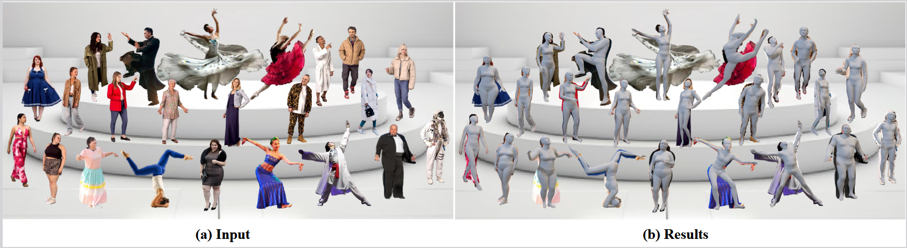
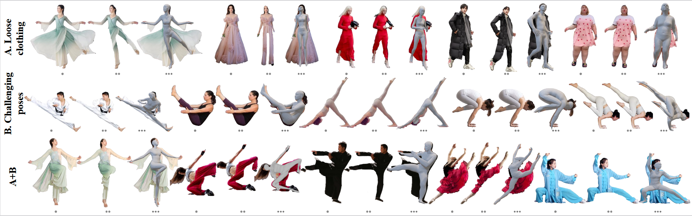

# 📄 ClothHMR: 3D Mesh Recovery of Humans in Diverse Clothing from Single Image
> *Yunqi Gao, Leyuan Liu, Yuhan Li, Changxin Gao, Yuanyuan Liu, Jingying Chen*  
> *ICMR 2025*  
> [[arXiv]]() | [[Project Page]]()  


## 📊 Results  


  
  

---

## 🛠 Installation  

```bash
git clone https://github.com/leyuanCv/ClothHMR.git
cd your_repo
conda create -n clothhmr python=3.10
conda activate clothhmr
pip install -r requirements.txt
```

---

## 🚀 Usage  

### Step 1: Download Pretrained Models 
Download the pretrained model from the following links and place it in the `data` folder:  
 [Google Drive](https://drive.google.com/file/d/1bIReXbDqDlIKiu3xqTguNZ6iXaDzSseR/view?usp=drive_link)

### Step 2:   
 Create the `images` path and place your input images there.  
Use [sapiens](https://github.com/facebookresearch/sapiens) to obtain the human depth map and 133 keypoints.  
Save the depth maps in the `images_depth` folder and the pose keypoints in the `images_pose` folder, following the structure shown in the `examples` directory.

### Step 3: Run Demo 
```bash
# Run demo
cd apps
python  infer.py --in_dir ./examples/images --out_dir ./examples/output
#You can use TokenHMR, PyMAF, or SPIN to obtain the initial SMPL model.
```

---


## 🙏 Acknowledgements  

We thank the authors of the following open-source projects for their valuable code and resources:

- [ECON](https://github.com/YuliangXiu/ECON)  
- [TokenHMR](https://github.com/saidwivedi/TokenHMR)
- [PyMAF](https://github.com/HongwenZhang/PyMAF)
- [SPIN](https://github.com/nkolot/SPIN)
- [SAPIENS](https://github.com/facebookresearch/sapiens)
---

## 📖 Citation  

If you find our work helpful, please consider citing our paper:

```bibtex
@inproceedings{Clothhmr,
  title     = {ClothHMR: 3D Mesh Recovery of Humans in Diverse Clothing from Single Image},
  author    = {Yunqi Gao, Leyuan Liu, Yuhan Li, Changxin Gao, Yuanyuan Liu, Jingying Chen},
  booktitle = {ICMR},
  year      = {2025}
}
```

---

## 📬 Contact  

For any questions, feel free to contact us via [gaoyunqi@mails.ccnu.edu.cn] or open an issue in this repository.

