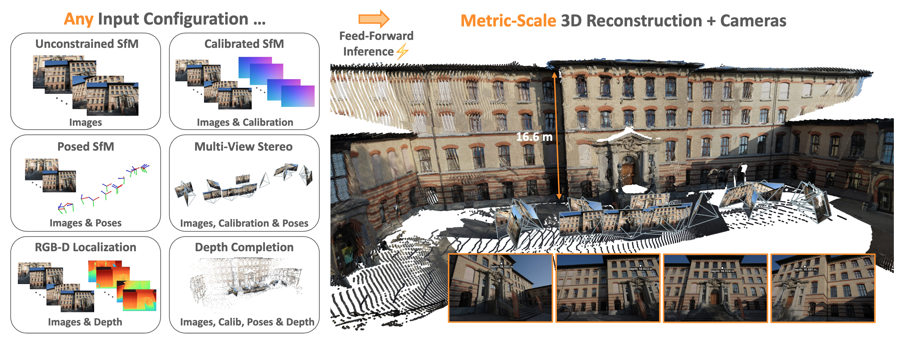
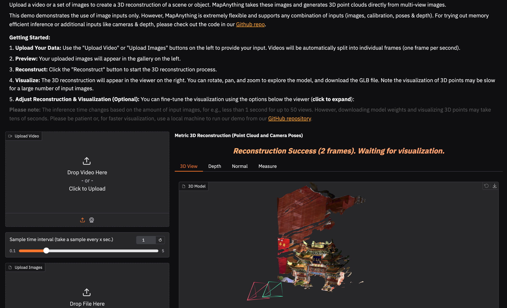

<div align="center">
<h1>MapAnything: Universal Feed-Forward Metric <br>3D Reconstruction</h1>
<a href="https://map-anything.github.io/assets/MapAnything.pdf"></a>
<a href="https://arxiv.org/abs/2509.13414"></a>
<a href="https://map-anything.github.io/"></a>
<a href="https://huggingface.co/spaces/facebook/map-anything"></a>
<br>
<br>
<strong>
<a href="https://nik-v9.github.io/">Nikhil Keetha<sup>1,2</sup></a>
&nbsp;&nbsp;
<a href="https://sirwyver.github.io/">Norman Müller<sup>1</sup></a>
&nbsp;&nbsp;
<a href="https://demuc.de/">Johannes Schönberger<sup>1</sup></a>
&nbsp;&nbsp;
<a href="https://www.linkedin.com/in/lorenzoporzi">Lorenzo Porzi<sup>1</sup></a>
&nbsp;&nbsp;
<a href="https://infinity1096.github.io/">Yuchen Zhang<sup>2</sup></a>
<br>
<a href="https://tobiasfshr.github.io/">Tobias Fischer<sup>1</sup></a>
&nbsp;&nbsp;
<a href="https://www.linkedin.com/in/arno-knapitsch">Arno Knapitsch<sup>1</sup></a>
&nbsp;&nbsp;
<a href="https://www.linkedin.com/in/duncan-zauss">Duncan Zauss<sup>1</sup></a>
&nbsp;&nbsp;
<a href="https://ethanweber.me/">Ethan Weber<sup>1</sup></a>
&nbsp;&nbsp;
<a href="https://www.linkedin.com/in/nelsonantunes7">Nelson Antunes<sup>1</sup></a>
<br>
<a href="https://x.com/jonathonluiten?lang=en">Jonathon Luiten<sup>1</sup></a>
&nbsp;&nbsp;
<a href="https://m.lopezantequera.com/">Manuel Lopez-Antequera<sup>1</sup></a>
&nbsp;&nbsp;
<a href="https://scholar.google.com/citations?user=484sccEAAAAJ">Samuel Rota Bulò<sup>1</sup></a>
&nbsp;&nbsp;
<a href="https://richardt.name/">Christian Richardt<sup>1</sup></a>
<br>
<a href="https://www.cs.cmu.edu/~deva/">Deva Ramanan<sup>2</sup></a>
&nbsp;&nbsp;
<a href="https://theairlab.org/team/sebastian/">Sebastian Scherer<sup>2</sup></a>
&nbsp;&nbsp;
<a href="https://www.linkedin.com/in/peter-kontschieder-2a6410134">Peter Kontschieder<sup>1</sup></a>
<br>
<br>
<sup>1</sup> Meta &nbsp;&nbsp;
<sup>2</sup> Carnegie Mellon University
</strong>

</div>

## Overview

MapAnything is a simple, end-to-end trained transformer model that directly regresses the factored metric 3D geometry of a scene given various types of inputs (images, calibration, poses, or depth). A single feed-forward model supports over 12 different 3D reconstruction tasks including multi-image sfm, multi-view stereo, monocular metric depth estimation, registration, depth completion and more.



## Table of Contents

- [Quick Start](#quick-start)
  - [Installation](#installation)
  - [Image-Only Inference](#image-only-inference)
  - [Multi-Modal Inference](#multi-modal-inference)
- [Interactive Demos](#interactive-demos)
  - [Online Demo](#online-demo)
  - [Local Gradio Demo](#local-gradio-demo)
  - [Rerun Demo](#rerun-demo)
- [COLMAP & GSplat Support](#colmap--gsplat-support)
  - [Exporting to COLMAP Format](#exporting-to-colmap-format)
  - [Integration with Gaussian Splatting](#integration-with-gaussian-splatting)
- [Data Processing for Training & Benchmarking](#data-processing-for-training--benchmarking)
- [Training](#training)
- [Benchmarking](#benchmarking)
- [Code License](#code-license)
- [Models](#models)
- [Building Blocks for MapAnything](#building-blocks-for-mapanything)
- [Acknowledgments](#acknowledgments)
- [Citation](#citation)

## Quick Start

### Installation

```bash
git clone https://github.com/facebookresearch/map-anything.git
cd map-anything

# Create and activate conda environment
conda create -n mapanything python=3.12 -y
conda activate mapanything

# Optional: Install torch, torchvision & torchaudio specific to your system
# Install MapAnything
pip install -e .

# For all optional dependencies
# See pyproject.toml for more details
pip install -e ".[all]"
pre-commit install
```

Note that we don't pin a specific version of PyTorch or CUDA in our requirements. Please feel free to install PyTorch based on your specific system.

### Image-Only Inference

For metric 3D reconstruction from images without additional geometric inputs:

```python
# Optional config for better memory efficiency
import os
os.environ["PYTORCH_CUDA_ALLOC_CONF"] = "expandable_segments:True"

# Required imports
import torch
from mapanything.models import MapAnything
from mapanything.utils.image import load_images

# Get inference device
device = "cuda" if torch.cuda.is_available() else "cpu"

# Init model - This requries internet access or the huggingface hub cache to be pre-downloaded
# For Apache 2.0 license model, use "facebook/map-anything-apache"
model = MapAnything.from_pretrained("facebook/map-anything").to(device)

# Load and preprocess images from a folder or list of paths
images = "path/to/your/images/"  # or ["path/to/img1.jpg", "path/to/img2.jpg", ...]
views = load_images(images)

# Run inference
predictions = model.infer(
    views,                            # Input views
    memory_efficient_inference=False, # Trades off speed for more views (up to 2000 views on 140 GB)
    use_amp=True,                     # Use mixed precision inference (recommended)
    amp_dtype="bf16",                 # bf16 inference (recommended; falls back to fp16 if bf16 not supported)
    apply_mask=True,                  # Apply masking to dense geometry outputs
    mask_edges=True,                  # Remove edge artifacts by using normals and depth
    apply_confidence_mask=False,      # Filter low-confidence regions
    confidence_percentile=10,         # Remove bottom 10 percentile confidence pixels
)

# Access results for each view - Complete list of metric outputs
for i, pred in enumerate(predictions):
    # Geometry outputs
    pts3d = pred["pts3d"]                     # 3D points in world coordinates (B, H, W, 3)
    pts3d_cam = pred["pts3d_cam"]             # 3D points in camera coordinates (B, H, W, 3)
    depth_z = pred["depth_z"]                 # Z-depth in camera frame (B, H, W, 1)
    depth_along_ray = pred["depth_along_ray"] # Depth along ray in camera frame (B, H, W, 1)

    # Camera outputs
    ray_directions = pred["ray_directions"]   # Ray directions in camera frame (B, H, W, 3)
    intrinsics = pred["intrinsics"]           # Recovered pinhole camera intrinsics (B, 3, 3)
    camera_poses = pred["camera_poses"]       # OpenCV (+X - Right, +Y - Down, +Z - Forward) cam2world poses in world frame (B, 4, 4)
    cam_trans = pred["cam_trans"]             # OpenCV (+X - Right, +Y - Down, +Z - Forward) cam2world translation in world frame (B, 3)
    cam_quats = pred["cam_quats"]             # OpenCV (+X - Right, +Y - Down, +Z - Forward) cam2world quaternion in world frame (B, 4)

    # Quality and masking
    confidence = pred["conf"]                 # Per-pixel confidence scores (B, H, W)
    mask = pred["mask"]                       # Combined validity mask (B, H, W, 1)
    non_ambiguous_mask = pred["non_ambiguous_mask"]                # Non-ambiguous regions (B, H, W)
    non_ambiguous_mask_logits = pred["non_ambiguous_mask_logits"]  # Mask logits (B, H, W)

    # Scaling
    metric_scaling_factor = pred["metric_scaling_factor"]  # Applied metric scaling (B,)

    # Original input
    img_no_norm = pred["img_no_norm"]         # Denormalized input images for visualization (B, H, W, 3)
```

### Multi-Modal Inference

MapAnything supports flexible combinations of geometric inputs for enhanced metric reconstruction. Steps to try it out:

**Initialize the model:**

```python
# Optional config for better memory efficiency
import os
os.environ["PYTORCH_CUDA_ALLOC_CONF"] = "expandable_segments:True"

# Required imports
import torch
from mapanything.models import MapAnything

# Get inference device
device = "cuda" if torch.cuda.is_available() else "cpu"

# Init model - This requries internet access or the huggingface hub cache to be pre-downloaded
# For Apache 2.0 license model, use "facebook/map-anything-apache"
model = MapAnything.from_pretrained("facebook/map-anything").to(device)
```

**Initialize the inputs:**

```python
# MapAnything is extremely flexible and supports any combination of inputs.
views_example = [
    {
        # View 0: Images + Calibration
        "img": image, # (H, W, 3) - [0, 255]
        "intrinsics": intrinsics, # (3, 3)
    },
    {
        # View 1: Images + Calibration + Depth
        "img": image, # (H, W, 3) - [0, 255]
        "intrinsics": intrinsics, # (3, 3)
        "depth_z": depth_z, # (H, W)
        "is_metric_scale": torch.tensor([True], device=device), # (1,)
    },
    {
        # View 2: Images + Calibration + Depth + Pose
        "img": image, # (H, W, 3) - [0, 255]
        "intrinsics": intrinsics, # (3, 3)
        "depth_z": depth_z, # (H, W)
        "camera_poses": camera_poses, # (4, 4) or tuple of (quats, trans) in OpenCV cam2world convention
        "is_metric_scale": torch.tensor([True], device=device), # (1,)
    },
    ...
]
```

Note that MapAnything expects the input camera poses to follow the OpenCV (+X - Right, +Y - Down, +Z - Forward) cam2world convention.

<!-- TODO: We provide a helper function `mapanything.utils.geometry.convert_cam_convention` to convert from other conventions to OpenCV (see the function in [geometry utils](./mapanything/utils/geometry.py) for more details). -->

<details>
<summary>Expand to show more examples</summary>

```python
# Example 1: Images + Camera Intrinsics
views_example = [
    {
        "img": image_tensor,  # (H, W, 3) - [0, 255]
        "intrinsics": intrinsics_tensor,  # (3, 3)
    },
    ...
]

# Example 2: Images + Intrinsics + Depth
views_example = [
    {
        "img": image_tensor, # (H, W, 3) - [0, 255]
        "intrinsics": intrinsics_tensor, # (3, 3)
        "depth_z": depth_tensor,  # (H, W)
        "is_metric_scale": torch.tensor([True]), # (1,)
    },
    ...
]

# Example 3: Images + Intrinsics + Camera Poses
views_example = [
    {
        "img": image_tensor, # (H, W, 3) - [0, 255]
        "intrinsics": intrinsics_tensor, # (3, 3)
        "camera_poses": pose_matrices,  # (4, 4) or tuple of (quats, trans) in OpenCV cam2world convention
        "is_metric_scale": torch.tensor([True]), # (1,)
    },
    ...
]

# Example 4: Images + Ray Directions + Depth (alternative to intrinsics)
views_example = [
    {
        "img": image_tensor, # (H, W, 3) - [0, 255]
        "ray_directions": ray_dirs_tensor,  # (H, W, 3)
        "depth_z": depth_tensor, # (H, W)
    }
    ...
]

# Example 5: Full Multi-Modal (Images + Intrinsics + Depth + Poses)
views_example = [
    {
        "img": image_tensor, # (H, W, 3) - [0, 255]
        "intrinsics": intrinsics_tensor, # (3, 3)
        "depth_z": depth_tensor, # (H, W)
        "camera_poses": pose_matrices, # (4, 4) or tuple of (quats, trans) in OpenCV cam2world convention
        "is_metric_scale": torch.tensor([True]), # (1,)
    }
    ...
]

# Example 6: Adaptive Mixed Inputs
views_example = [
    {
        # View 0: Images + Pose
        "img": images, # (H, W, 3) - [0, 255]
        "camera_poses": camera_poses, # (4, 4) or tuple of (quats, trans) in OpenCV cam2world convention
    },
    {
        # View 1: Images + Calibration
        "img": images, # (H, W, 3) - [0, 255]
        "intrinsics": intrinsics, # (3, 3)
    },
    {
        # View 2: Images + Calibration + Depth
        "img": images, # (H, W, 3) - [0, 255]
        "intrinsics": intrinsics, # (3, 3)
        "depth_z": depth_z, # (H, W)
        "is_metric_scale": torch.tensor([True], device=device), # (1,)
    },
    {
        # View 3: Images + Calibration + Depth + Pose
        "img": images, # (H, W, 3) - [0, 255]
        "intrinsics": intrinsics, # (3, 3)
        "depth_z": depth_z, # (H, W)
        "camera_poses": camera_poses, # (4, 4) or tuple of (quats, trans) in OpenCV cam2world convention
        "is_metric_scale": torch.tensor([True], device=device), # (1,)
    },
    ...
]
```
</details>

<br>

**Run model inference:**

```python
from mapanything.utils.image import preprocess_inputs

# Preprocess inputs to the expected format
processed_views = preprocess_inputs(views_example)

# Run inference with any combination of inputs
predictions = model.infer(
    processed_views,                  # Any combination of input views
    memory_efficient_inference=False, # Trades off speed for more views (up to 2000 views on 140 GB)
    use_amp=True,                     # Use mixed precision inference (recommended)
    amp_dtype="bf16",                 # bf16 inference (recommended; falls back to fp16 if bf16 not supported)
    apply_mask=True,                  # Apply masking to dense geometry outputs
    mask_edges=True,                  # Remove edge artifacts by using normals and depth
    apply_confidence_mask=False,      # Filter low-confidence regions
    confidence_percentile=10,         # Remove bottom 10 percentile confidence pixels
    # Control which inputs to use/ignore
    # By default, all inputs are used when provided
    # If is_metric_scale flag is not provided, all inputs are assumed to be in metric scale
    ignore_calibration_inputs=False,
    ignore_depth_inputs=False,
    ignore_pose_inputs=False,
    ignore_depth_scale_inputs=False,
    ignore_pose_scale_inputs=False,
)

# Access results for each view - Complete list of metric outputs
# Outputs are the same as above (image-only input case), but with additional inputs used
```

**Input requirements for `model.infer`:**
- `img`: RGB images normalized according to `data_norm_type`
- `data_norm_type`: Normalization type (must match model's encoder requirements)

**Optional geometric inputs supported by `model.infer`:**
- `intrinsics` OR `ray_directions`: Camera calibration (cannot provide both since they are redundant)
- `depth_z`: Z-depth maps (requires calibration info)
- `camera_poses`: OpenCV (+X - Right, +Y - Down, +Z - Forward) cam2world poses as 4×4 matrices or (quaternions, translations)
- `is_metric_scale`: Whether inputs are in metric scale

**Key constraints for `model.infer`:**
- If `depth_z` is provided, must also provide `intrinsics` or `ray_directions`
- If any view has `camera_poses`, the first view (reference) must also have them
- Cannot provide both `intrinsics` and `ray_directions` simultaneously (they are redundant)

The above constraints are enforced in the inference API. However, if desired, the underlying `model.forward` can support any arbitrary combination of inputs (a total of 64 configurations; without counting per view flexibility).

## Interactive Demos

We provide multiple interactive demos to try out MapAnything!

### Online Demo

Try our online demo without installation: [🤗 Hugging Face Demo](https://huggingface.co/spaces/facebook/map-anything)

### Local Gradio Demo

We provide a script to launch our Gradio app. The interface and GUI mirrors our [online demo](https://huggingface.co/spaces/facebook/map-anything) where you can upload images/videos, run reconstruction and interactively view them. You can launch this using:

```bash
# Install requirements for the app
pip install -e ".[gradio]"

# Launch app locally
python scripts/gradio_app.py
```

<details>
<summary>Expand to preview the Gradio demo interface</summary>


</details>

### Rerun Demo

We provide a demo script for interactive 3D visualization of metric reconstruction results using [Rerun](https://rerun.io/).

```bash
# Terminal 1: Start the Rerun server
rerun --serve --port 2004 --web-viewer-port 2006

# Terminal 2: Run MapAnything demo
# Use --memory_efficient_inference for running inference on a larger number of views
python scripts/demo_images_only_inference.py \
    --image_folder /path/to/your/images \
    --viz \
    --save_glb \
    --output_path /path/to/output.glb

# Terminal 3: Open web viewer at http://127.0.0.1:2006 (You might need to port forward if using a remote server)
```

Use `--apache` flag to use the Apache 2.0 licensed model. Optionally, if rerun is installed locally, local rerun viewer can be spawned using: `rerun --connect rerun+http://127.0.0.1:2004/proxy`.

## COLMAP & GSplat Support

We build on top of [VGGT's COLMAP demo](https://github.com/facebookresearch/vggt?tab=readme-ov-file#exporting-to-colmap-format) to enable support for COLMAP & GSplat.

### Exporting to COLMAP Format

MapAnything's predictions can directly be converted to COLMAP format by using:

```bash
# Install requirements for this specific demo
pip install -e ".[colmap]"

# Feed-forward prediction only
# Use the memory efficient inference flag to run on a larger number of images at the cost of slower speed
python scripts/demo_colmap.py --scene_dir=/YOUR/SCENE_DIR/ --memory_efficient_inference

# With bundle adjustment
python scripts/demo_colmap.py --scene_dir=/YOUR/SCENE_DIR/ --memory_efficient_inference --use_ba

# Run with bundle adjustment using reduced parameters for faster processing
# Reduces max_query_pts from 4096 (default) to 2048 and query_frame_num from 8 (default) to 5
# Trade-off: Faster execution but potentially less robust reconstruction in complex scenes (you may consider setting query_frame_num equal to your total number of images)
# See demo_colmap.py for additional bundle adjustment configuration options
python scripts/demo_colmap.py --scene_dir=/YOUR/SCENE_DIR/ --memory_efficient_inference --use_ba --max_query_pts=2048 --query_frame_num=5
```

Please ensure that the images are stored in `/YOUR/SCENE_DIR/images/`. This folder should contain only the images. Check the examples folder for the desired data structure.

The reconstruction result (camera parameters and 3D points) will be automatically saved under `/YOUR/SCENE_DIR/sparse/` in the COLMAP format, such as:

```
SCENE_DIR/
├── images/
└── sparse/
    ├── cameras.bin
    ├── images.bin
    └── points3D.bin
    └── points.ply
```

### Integration with Gaussian Splatting

The exported COLMAP files can be directly used with [gsplat](https://github.com/nerfstudio-project/gsplat) for Gaussian Splatting training. Install `gsplat` following their official instructions (we recommend `gsplat==1.3.0`):

An example command to train the model is:
```
cd <path_to_gsplat>
python examples/simple_trainer.py  default --data_factor 1 --data_dir /YOUR/SCENE_DIR/ --result_dir /YOUR/RESULT_DIR/
```

## Data Processing for Training & Benchmarking

We provide details in the [Data Processing README](data_processing/README.md).

## Training

We provide comprehensive training instructions, scripts, and configurations to reproduce MapAnything and train custom models. See [Training README](train.md) for detailed training instructions, including:
- Data setup and processing for all 13 training datasets used in the paper
- Quick start examples with memory optimization tips
- All main model and ablation training scripts from the paper
- Fine-tuning support for other geometry estimation models like MoGe-2, VGGT, π³ showcasing the modularity of our framework

## Benchmarking

We provide comprehensive benchmarking scripts and instructions for evaluating MapAnything across multiple tasks and datasets. All original bash scripts used for benchmarking are available in the `/bash_scripts/benchmarking/` folder.

### Available Benchmarks

1. **Dense Up-to-N-View Reconstruction Benchmark**
   See [Dense Up-to-N-View Benchmark README](benchmarking/dense_n_view/README.md) for detailed instructions on evaluating dense multi-view metric reconstruction.

2. **Single-View Image Calibration Benchmark**
   See [Calibration Benchmark README](benchmarking/calibration/README.md) for detailed instructions on evaluating camera intrinsic prediction from single images.

3. **RobustMVD Benchmark**
   See [RMVD Benchmark README](benchmarking/rmvd_mvs_benchmark/README.md) for detailed instructions on using the RobustMVD benchmark.

## Code License

This code is licensed under an open-source [Apache 2.0 license](LICENSE).

## Models

We release **two variants** of the pre-trained MapAnything models on Hugging Face Hub, each with different licensing based on the underlying training datasets:

### 🤗 Hugging Face Hub Models

1. **[facebook/map-anything](https://huggingface.co/facebook/map-anything)** (CC-BY-NC 4.0 License)
2. **[facebook/map-anything-apache](https://huggingface.co/facebook/map-anything-apache)** (Apache 2.0 License)

### Model Selection Guide

- **For Research & Academic Use**: Use `facebook/map-anything` for the best performance
- **For Commercial Use**: Use `facebook/map-anything-apache` for commercial-friendly licensing

Both models support the same API and functionality. The only difference is the training data composition and resulting license terms. Please see our paper for detailed information about the specific datasets used in each model variant.

### Optional Checkpoint Conversion

The MapAnything training/benchmarking framework expects trained checkpoints in a specific format with a `model` key. The HuggingFace checkpoints can be easily converted to the expected format using:

```bash
# Convert default CC-BY-NC model
python scripts/convert_hf_to_benchmark_checkpoint.py \
    --output_path checkpoints/facebook_map-anything.pth

# Convert Apache 2.0 model for commercial use
python scripts/convert_hf_to_benchmark_checkpoint.py \
    --apache \
    --output_path checkpoints/facebook_map-anything-apache.pth
```

## Building Blocks for MapAnything

UniCeption & WorldAI (WAI) Data are two crucial building blocks and have been developed for ease of use by the community:

🌍 [UniCeption](https://github.com/castacks/UniCeption/tree/main) is a library which contains modular, config-swappable components for assembling end-to-end networks.

🌍 [WAI](./data_processing/README.md) is a unified data format for all things 3D, 4D & Spatial AI. It enables easy, scalable and reproducable data processing.

We strongly encourage the community to build on top of the tools and submit PRs! This also enables us to release stronger models (both apache and research use) as the community adds more datasets to WAI and builds on top of UniCeption/MapAnything.

### Related Research

Check out our related work which also use UniCeption & WAI:

🚀 [UFM: A Simple Path towards Unified Dense Correspondence with Flow](https://uniflowmatch.github.io/)

🚀 [FlowR: Flowing from Sparse to Dense 3D Reconstructions](https://tobiasfshr.github.io/pub/flowr/)

## Acknowledgments

We thank the folowing projects for their open-source code: [DUSt3R](https://github.com/naver/dust3r), [MASt3R](https://github.com/naver/mast3r), [RayDiffusion](https://github.com/jasonyzhang/RayDiffusion), [MoGe](https://github.com/microsoft/moge), [VGGSfM](https://github.com/facebookresearch/vggsfm), [VGGT](https://github.com/facebookresearch/vggt), [MaRePo](https://github.com/nianticlabs/marepo), and [DINOv2](https://github.com/facebookresearch/dinov2).

## Citation

If you find our repository useful, please consider giving it a star ⭐ and citing our paper in your work:

```bibtex
@misc{keetha2025mapanything,
  title={{MapAnything}: Universal Feed-Forward Metric {3D} Reconstruction},
  author={Nikhil Keetha and Norman M\"{u}ller and Johannes Sch\"{o}nberger and Lorenzo Porzi and Yuchen Zhang and Tobias Fischer and Arno Knapitsch and Duncan Zauss and Ethan Weber and Nelson Antunes and Jonathon Luiten and Manuel Lopez-Antequera and Samuel Rota Bul\`{o} and Christian Richardt and Deva Ramanan and Sebastian Scherer and Peter Kontschieder},
  note={arXiv preprint arXiv:2509.13414},
  year={2025}
}
```
