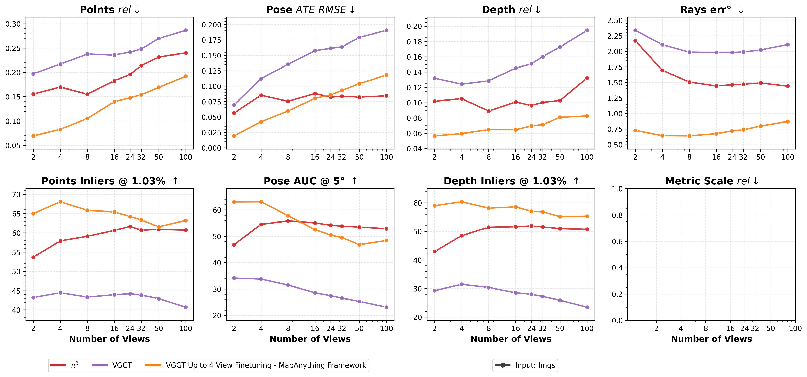

# Modular MapAnything Training Pipeline

## Overview

We release the complete data processing pipeline, metadata, training scripts, and configs to exactly reproduce the final released version of MapAnything. We also provide training bash scripts for all main models and ablations reported in the paper.

## Data Processing

Before training, setup all the WAI format data following the [Data Processing README](./data_processing/README.md). Once converted, verify the dataloaders work correctly, for example:

```bash
# Verify BlendedMVS dataloader with Rerun visualization
python mapanything/datasets/wai/blendedmvs.py \
    --root_dir /path/to/blendedmvs \
    --dataset_metadata_dir /path/to/metadata \
    --num_of_views 4 \
    --viz
```

See the main call in each dataloader file (e.g., `mapanything/datasets/wai/blendedmvs.py`) for more details and use `--viz` for Rerun visualization. Our dataloaders by default support varying number of views during training.

## Quick Start: Single Dataset Training

For quick experimentation, we provide a single dataset example using BlendedMVS (see `bash_scripts/train/examples/mapa_curri_4v_bmvs_48ipg_8g.sh` or `bash_scripts/train/examples/mapa_img_only_4v_bmvs_48ipg_8g.sh`).

**Tips:**

💡 Use `model.info_sharing.module_args.gradient_checkpointing=true` and `model.pred_head.gradient_checkpointing=true` to save GPU memory

💡 Adjust `max_num_of_imgs_per_gpu` to control memory usage and effective batch size

💡 Scale learning rate proportionally when changing batch size (effective batch size at a given number of views during training = `NUM_GPUS × max_num_of_imgs_per_gpu / num_of_views`)

## Main Training Scripts

All original training bash scripts are available in `bash_scripts/train/`. The main models from the paper can be reproduced using:

```bash
# Stage 1: 4-view training
bash bash_scripts/train/main/mapa_curri_4v_13d_48ipg_64g.sh 8

# Stage 2: 24-view training
bash bash_scripts/train/main/mapa_curri_24v_13d_48ipg_64g.sh 8

# Likewise for Apache 2.0 licensed variants
bash bash_scripts/train/main/mapa_curri_4v_6d_48ipg_8g_apache.sh 8
bash bash_scripts/train/main/mapa_curri_24v_6d_48ipg_64g_apache.sh 8
```

Update the machine configuration in `configs/machine/your_machine.yaml` and adjust paths in the bash scripts before execution.

## Paper Ablations

We provide bash scripts for all ablations studied in the paper (see `bash_scripts/train/ablations/`).

## Fine-tuning Other Models

Beyond MapAnything training, our modular data and training pipeline can improve performance of other models. We provide fine-tuning scripts for:

### MoGe-2 Fine-tuning
```bash
bash bash_scripts/train/finetuning/moge2_finetuning.sh 8
```

### VGGT Fine-tuning
```bash
bash bash_scripts/train/finetuning/vggt_finetuning.sh 8
```

### π³ Fine-tuning (with Equivariant Reference Frame)
```bash
bash bash_scripts/train/finetuning/pi3_finetuning.sh 8
```

These scripts demonstrate how our comprehensive training data and pipeline can enhance existing 3D reconstruction models, including support for equivariant reference frames (i.e., the scheme used by π³).

### Example Fine-tuning Results

We show the average performance on ETH3D, ScanNet++V2 & TartanAirV2-WB at varying number of views for our finetuned VGGT using the MapAnything data and training pipeline. Note that there might be data leak for π³ on our ScanNet++V2 & TartanAirV2-WB benchmarking since the train scene splits are unknown. Despite this, we show that our finetuned model shows higher performance than π³ (finetuned on top of VGGT):



## Configuration System

MapAnything uses Hydra for configuration management. Key configuration categories:

- **Overall**: `configs/train.yaml` - Entrypoint
- **Machine**: `configs/machine/` - Path settings
- **Dataset**: `configs/dataset/` - Dataset selection and parameters
- **Model**: `configs/model/` - Model architecture configurations
- **Loss**: `configs/loss/` - Loss function definitions
- **Train Params**: `configs/train_params/` - Training hyperparameters

## Multi-Node Training

For large-scale training, use the multi-node configurations in the main training scripts:

```bash
# Example multi-node execution
bash bash_scripts/train/main/mapa_curri_24v_13d_48ipg_64g.sh \
    NUM_GPUS NUM_NODES NODE_RANK JOB_ID HOST_NODE_ADDR MAX_RESTARTS
```

The scripts include optimized settings for AWS multi-node training with EFA networking. These can be removed/updated based on your compute infrastructure.

## Dataset Coverage

The training scripts support all 13 training datasets (with appropriate splits) converted to WAI format:

1. ✅ [Aria Synthetic Environments](https://www.projectaria.com/datasets/ase/)
2. ✅ [BlendedMVS](https://github.com/YoYo000/BlendedMVS)
3. ✅ [DL3DV-10K](https://dl3dv-10k.github.io/DL3DV-10K/)
4. ✅ [Dynamic Replica](https://dynamic-stereo.github.io/)
5. ✅ [Mapillary Planet Scale Depth & Reconstructions](https://www.mapillary.com/dataset/depth) (MPSD)
6. ✅ [MegaDepth (including Tanks & Temples)](https://www.cs.cornell.edu/projects/megadepth/)
7. ✅ [MVS-Synth](https://phuang17.github.io/DeepMVS/mvs-synth.html)
8. ✅ [Parallel Domain 4D](https://gcd.cs.columbia.edu/#datasets)
9. ✅ [SAIL-VOS 3D](https://sailvos.web.illinois.edu/_site/_site/index.html)
10. ✅ [ScanNet++ v2](https://kaldir.vc.in.tum.de/scannetpp/)
11. ✅ [Spring](https://spring-benchmark.org/)
12. ✅ [TartanAirV2 Wide Baseline](https://uniflowmatch.github.io/)
13. ✅ [UnrealStereo4K](https://github.com/fabiotosi92/SMD-Nets)

## Reproducing Results

To exactly reproduce the paper results:

1. Process datasets using instructions in [Data Processing README](./data_processing/README.md)
2. Download pre-computed metadata from [HuggingFace](https://huggingface.co/datasets/facebook/map-anything)
3. Run the main training scripts with your machine configuration
4. Use the same hyperparameters and data splits as provided in the configs

Results will be saved to the configured `hydra.run.dir` directory with regular checkpointing and training logs.
